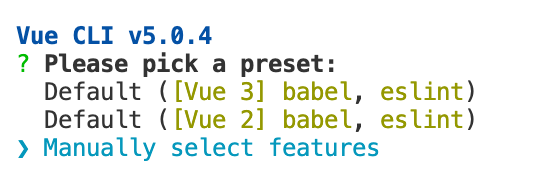
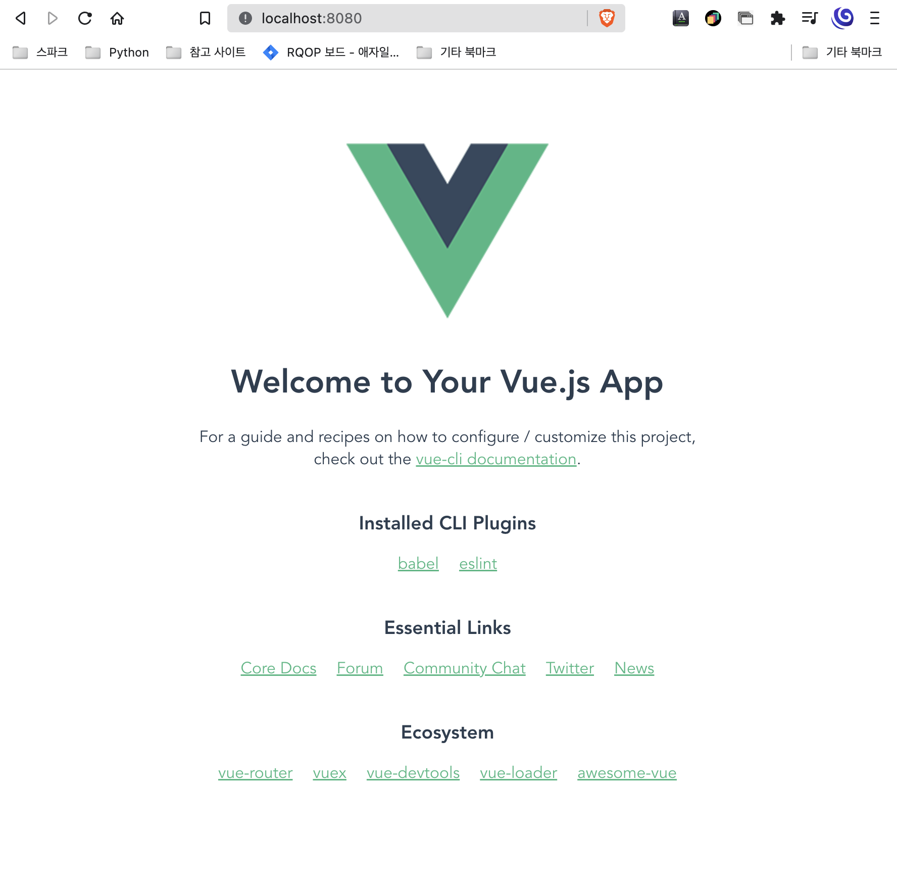

## 프로젝트 생성
Vue CLI 에서 프로젝트 구조를 쉽게 생성할 수 있는 create 명령어를 지원합니다.

```bash
vue create tutorial
```



Default [Vue 3]를 선택했어요.

---

## 프로젝트 빌드

```bash
cd tutorial
npm run serve
```

localhost:8080에 접속해서 
`Welcome to Yure Vue.js App` 메시지가 뜨면 
정상적으로 Vue CLI가 설치됐고, 프로젝트가 생성된 것이라고 합니다.

