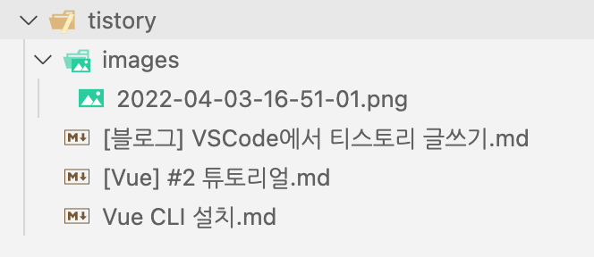
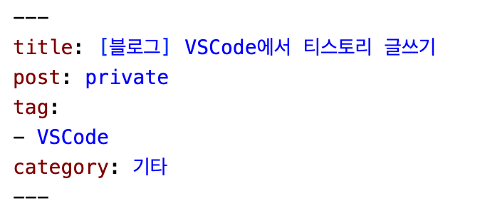

# 마크다운으로 블로그 글을 쓰고 싶다..!

다시 블로그도 꾸몄고 하니, 글을 꾸준히 써보려고 합니다.

그런데 최근에 마크다운으로 글을 쓰는 것과 VSCode로 모든 작업을 하는게 익숙해져서 티스토리 블로그에 들어가서 글을 쓰는게 귀찮았습니다.

특히 마크다운으로 VSCode에서 글을 쓴 다음에 티스토리 블로그에서 마크다운 모드로 복사 붙여넣기 하다보니... 이미지를 관리하는게 너무 귀찮아졌어요.

그래서 혹시 더 쉬운 방법이 있을까 싶어 찾아보다보니..
[greenflamingo님](https://greenflamingo.tistory.com/107?category=1022395)이 만들어두신 [vscode with tistory 확장 프로그램](https://marketplace.visualstudio.com/items?itemName=green-flamingo.vscode-with-tistory)을 발견했습니다.

설명에서 시키는대로 따라 했고,
실제 사용해보니 너무 편했습니다..!
Paste Image 확장프로그램으로 캡쳐한 이미지를 `option + cmd + v`로 붙여넣고, 상단의 yaml 형식으로 포스팅 내용을 적으면 `F1 -> Push Post`만으로도 글과 이미지가 바로 올라가더라고요.

좋은 확장 프로그램 만들어주신 green-flamingo님께 감사드립니다.

## Reference
1. [vscode with tistory 확장 프로그램](https://marketplace.visualstudio.com/items?itemName=green-flamingo.vscode-with-tistory)
2. [greenflamingo님 블로그](https://greenflamingo.tistory.com/)
3. [VScode에서 이미지 캡쳐를 슬기롭게 사용하는 방법(feat. Paste Image)](https://uxgjs.tistory.com/187)